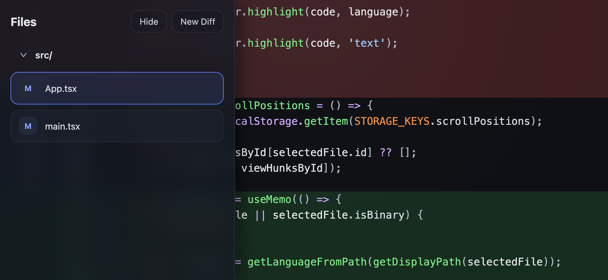

# Web Diff Viewer

A tiny, static, client‑only web app for viewing unified `.diff` files. It’s optimized for mobile (iOS Safari first) and keeps the code view full‑screen with a simple file tree drawer.

Live demo: https://nbredikhin.github.io/web-diff-viewer/
Example diff: `https://github.com/nbredikhin/web-diff-viewer/pull/5.diff`



## Why this exists
This project is a practical sandbox for learning how to build lightweight AI‑assisted tools: parsing diffs, rendering syntax‑highlighted views, and designing a focused mobile UX.

## ✨ Disclaimer (aka the Vibes Clause)
This codebase is **entirely vibe‑coded** — exploratory, experimental, and intentionally lightweight. It was built for **educational purposes** to gain hands‑on experience with AI agents, rapid prototyping, and UI iteration. Expect rough edges, trade‑offs, and opinions. Use it as a learning reference, not as production‑grade infrastructure.

## Structure (brief)
- `src/App.tsx`: top‑level view logic and state.
- `src/utils/`: diff parsing and helpers.
- `src/styles.css` + `src/prism-theme.css`: styling and syntax highlighting.
- `SPEC.md`: product spec and UX goals.
- `ADR.md`: architectural decisions.

## How to run
Requires Node.js and npm.

```bash
npm install
npm run dev
```

Build for production:

```bash
npm run build
```

Preview the production build locally:

```bash
npm run preview
```

## Features
- Upload or paste a single unified diff
- File tree drawer for navigation
- GitLab‑style unified diff view
- Syntax highlighting by file extension
- Local persistence (last diff, file, scroll position)

## Non‑goals
- Side‑by‑side diff view
- Collaboration or comments
- Server‑side processing

---

If you’re here to learn, fork, tinker, and make it your own.
